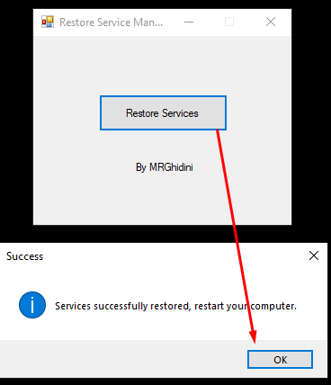

# Restore-Service-Manager-SAP-B1

 Application to restore the Service manager, when the list of services is inactive
 
# Situation in which it applies

For you who are going or will go through the situation where you are unable to log into SAP, and you are faced with the service manager in the situation below. (Service manager disabled)

Situation 1 

Situation 2

 
# How to solve ?

Just run download run a latest version at link (here [Download last version](https://github.com/MRGhidini/SHM/releases/latest))

 
After running restart the computer that will have the result below.

## Special thanks  
- I thank SAP for giving us a great job and a constant learning curve.
- I thank all of the SAP Community for all the situations in which this application was needed to resolve.
